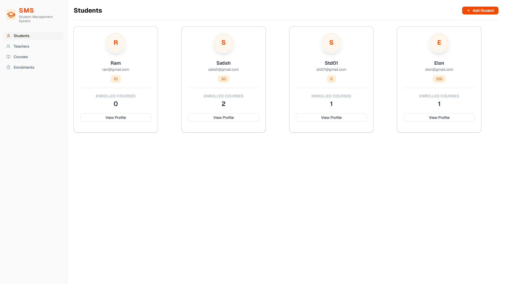
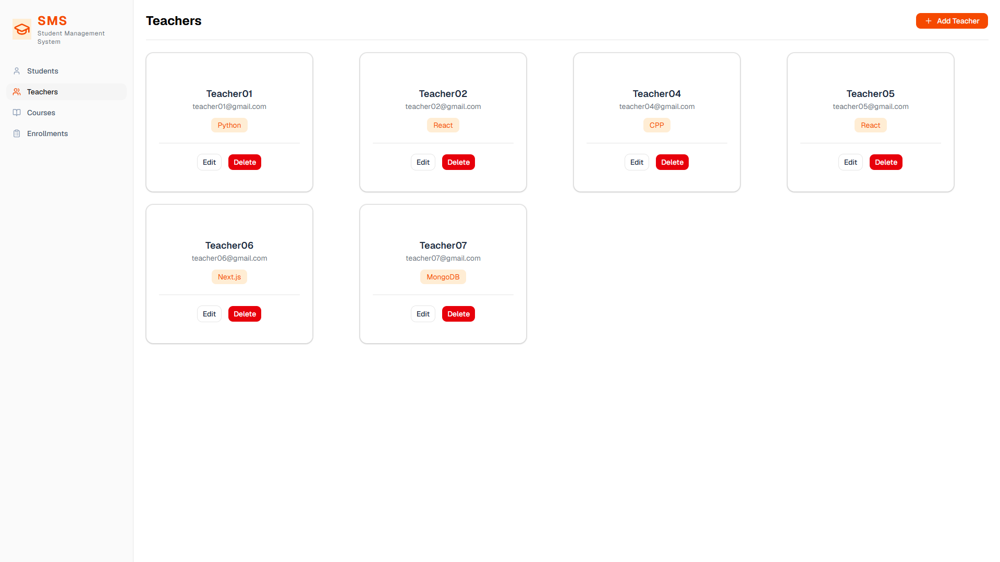
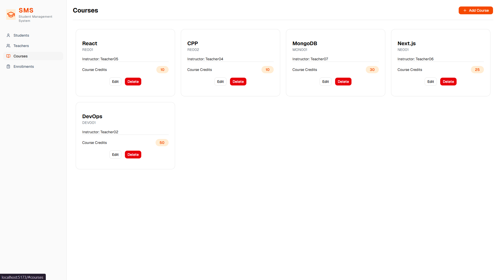
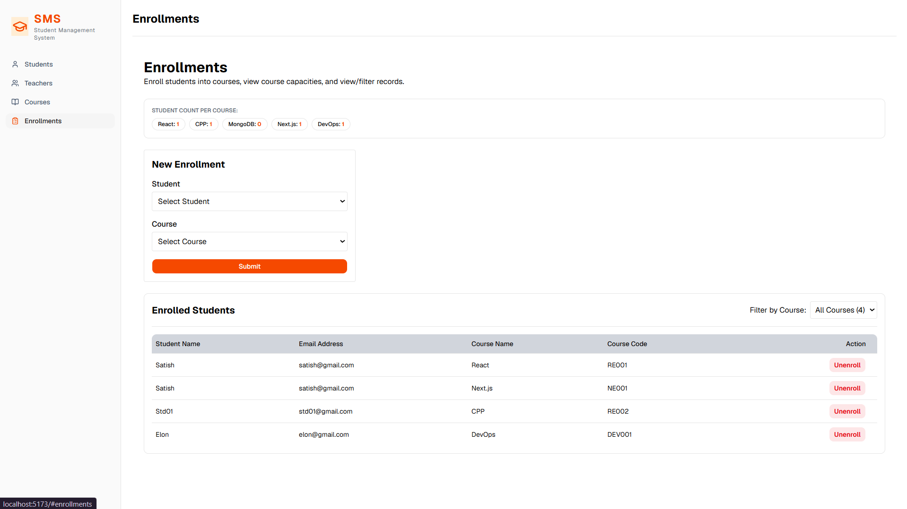
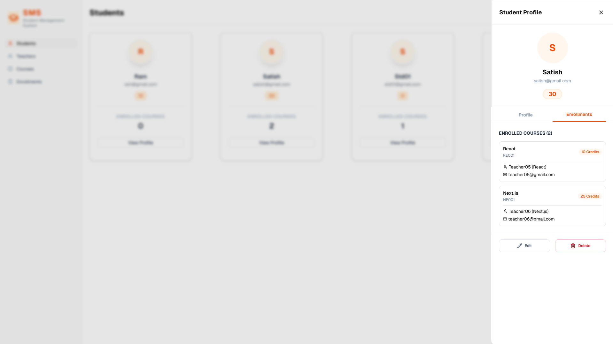
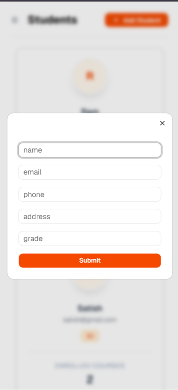
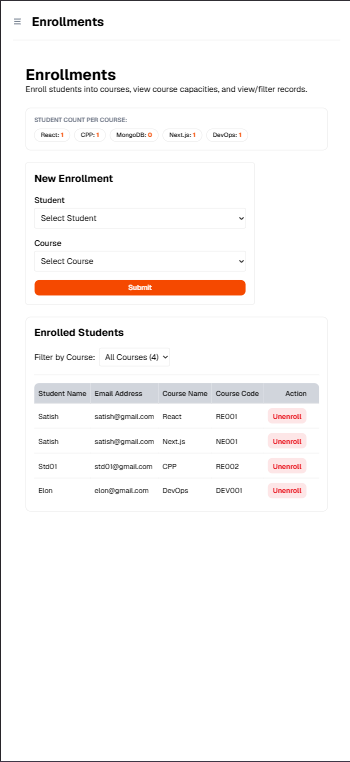
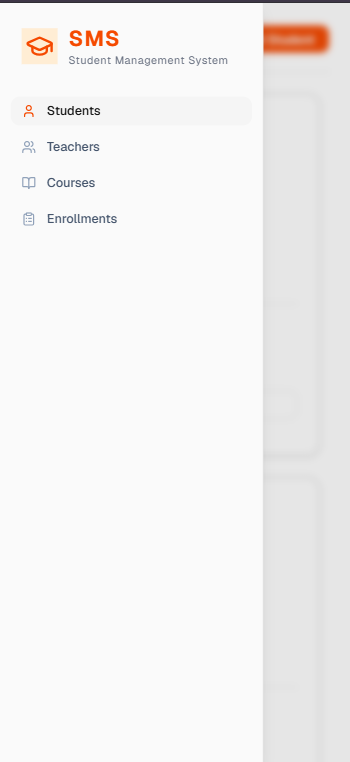

# Student Management System

A full-stack web application for managing students, teachers, courses, and enrollments. Built with React 19 + Vite on the frontend and Express 5 + MongoDB on the backend.

---

## Screenshots

### Core Management Pages

| Students Page | Teachers Page |
| :---: | :---: |
|  |  |

| Courses Page | Enrollments Page |
| :---: | :---: |
|  |  |

### Components & Responsiveness

| Student Profile Panel | Add/Edit Form Modal |
| :---: | :---: |
|  |  |

| Responsive Enrollments | Responsive Sidebar |
| :---: | :---: |
|  |  |

---


## Tech Stack

**Frontend**
- React 19, Vite 8
- Tailwind CSS v4, shadcn/ui, Radix UI
- Axios, Lucide React, Vaul

**Backend**
- Node.js, Express 5 (ESM)
- MongoDB, Mongoose 9
- dotenv, CORS, Nodemon

---

## Project Structure

```
student-management-system/
├── client/                  # React frontend (Vite)
│   ├── src/
│   │   ├── components/      # UI components
│   │   ├── pages/           # Route pages
│   │   └── main.jsx
│   └── package.json
│
└── server/                  # Express backend
    ├── config/
    │   └── db.js            # MongoDB connection
    ├── controllers/
    │   ├── studentController.js
    │   ├── teacherController.js
    │   ├── courseController.js
    │   └── enrollmentController.js
    ├── models/
    │   ├── student.js
    │   ├── teacher.js
    │   ├── course.js
    │   └── enrollment.js
    ├── routes/
    │   ├── studentRoutes.js
    │   ├── teacherRoutes.js
    │   ├── courseRoutes.js
    │   └── enrollmentRoutes.js
    ├── app.js               # Express app + middleware
    ├── server.js            # Entry point
    └── package.json
```

---

## Setup Instructions

### Prerequisites

- Node.js v18+
- MongoDB (local or Atlas)

### 1. Clone the repository

```bash
git clone https://github.com/swamiabhishek45/student-management-system.git
cd student-management-system
```

### 2. Configure environment variables

Create a `.env` file inside the `server/` directory:

```env
MONGO_URI=mongodb://localhost:27017/student-management
PORT=5000
```

### 3. Install dependencies

```bash
# Server
cd server
npm install

# Client
cd ../client
npm install
```

### 4. Run the development servers

```bash
# Start backend (from /server)
npm start

# Start frontend (from /client)
npm run dev
```

The backend runs on `http://localhost:5000` and the frontend on `http://localhost:5173`.

---

## API Documentation

Base URL: `http://localhost:5000/api`

---

### Students `/api/students`

| Method | Endpoint | Description |
|--------|----------|-------------|
| GET | `/api/students` | Get all students |
| GET | `/api/students/:id` | Get student by ID |
| POST | `/api/students` | Create a new student |
| PUT | `/api/students/:id` | Update a student |
| DELETE | `/api/students/:id` | Delete a student (also removes enrollments) |

**POST /api/students — Request Body**

```json
{
  "name": "Riya Sharma",
  "email": "riya@example.com",
  "phone": "9876543210",
  "grade": "10th",
  "address": "Pune, Maharashtra"
}
```

**Response (201)**

```json
{
  "student": {
    "_id": "64f1a...",
    "studentId": "STU1720000000000",
    "name": "Riya Sharma",
    "email": "riya@example.com",
    "phone": "9876543210",
    "grade": "10th",
    "address": "Pune, Maharashtra",
    "createdAt": "2025-01-01T00:00:00.000Z",
    "updatedAt": "2025-01-01T00:00:00.000Z"
  },
  "message": "student created successfully!"
}
```

> `studentId` is auto-generated as `STU` + `Date.now()`. Email must be unique.

---

### Teachers `/api/teachers`

| Method | Endpoint | Description |
|--------|----------|-------------|
| GET | `/api/teachers` | Get all teachers |
| GET | `/api/teachers/:id` | Get teacher by ID |
| POST | `/api/teachers` | Create a new teacher |
| PUT | `/api/teachers/:id` | Update a teacher |
| DELETE | `/api/teachers/:id` | Delete a teacher |

**POST /api/teachers — Request Body**

```json
{
  "name": "Arjun Mehta",
  "email": "arjun@example.com",
  "subject": "Mathematics"
}
```

---

### Courses `/api/courses`

| Method | Endpoint | Description |
|--------|----------|-------------|
| GET | `/api/courses` | Get all courses |
| GET | `/api/courses/:id` | Get course by ID |
| POST | `/api/courses` | Create a new course |
| PUT | `/api/courses/:id` | Update a course |
| DELETE | `/api/courses/:id` | Delete a course |
| GET | `/api/courses/teacher/:teacherId` | Get courses assigned to a teacher |

**POST /api/courses — Request Body**

```json
{
  "name": "Algebra Fundamentals",
  "code": "MATH101",
  "credits": 4,
  "teacherId": "64f2b..."
}
```

> `code` must be unique. `teacherId` must reference a valid Teacher document.

---

### Enrollments `/api/enrollments`

| Method | Endpoint | Description |
|--------|----------|-------------|
| POST | `/api/enrollments` | Enroll a student in a course |
| GET | `/api/enrollments` | Get all enrollments |
| GET | `/api/enrollments/course/:courseId` | Get enrollments for a specific course |
| DELETE | `/api/enrollments/:id` | Unenroll a student |

**POST /api/enrollments — Request Body**

```json
{
  "studentId": "64f1a...",
  "courseId": "64f3c..."
}
```

> Duplicate enrollments (same student + course) are prevented at the database level via a unique compound index.

---

## MongoDB Schema Design

### Student

```
students collection
├── studentId    String   required, unique   (auto-generated: "STU" + Date.now())
├── name         String   required
├── email        String   required, unique
├── phone        String   required
├── address      String   required
├── grade        String   required
├── createdAt    Date     auto (timestamps)
└── updatedAt    Date     auto (timestamps)
```

### Teacher

```
teachers collection
├── name         String   required
├── email        String   required, unique
└── subject      String   required
```

### Course

```
courses collection
├── name         String           required
├── code         String           required, unique
├── credits      Number           required
├── teacherId    ObjectId → Teacher   required (ref)
├── createdAt    Date             auto (timestamps)
└── updatedAt    Date             auto (timestamps)
```

### Enrollment

```
enrollments collection
├── studentId    ObjectId → Student   required (ref)
├── courseId     ObjectId → Course    required (ref)
├── enrollDate   Date                 default: Date.now
├── createdAt    Date                 auto (timestamps)
└── updatedAt    Date                 auto (timestamps)

Compound unique index: { studentId: 1, courseId: 1 }
```

**Relationships**

```
Student ──< Enrollment >── Course
                              │
                           Teacher
```

- One student can enroll in many courses
- One course can have many enrolled students
- Each course is assigned to one teacher
- Deleting a student cascades and removes their enrollments

---

## License

MIT
